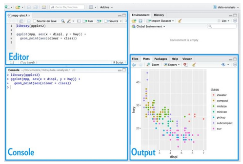
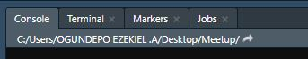
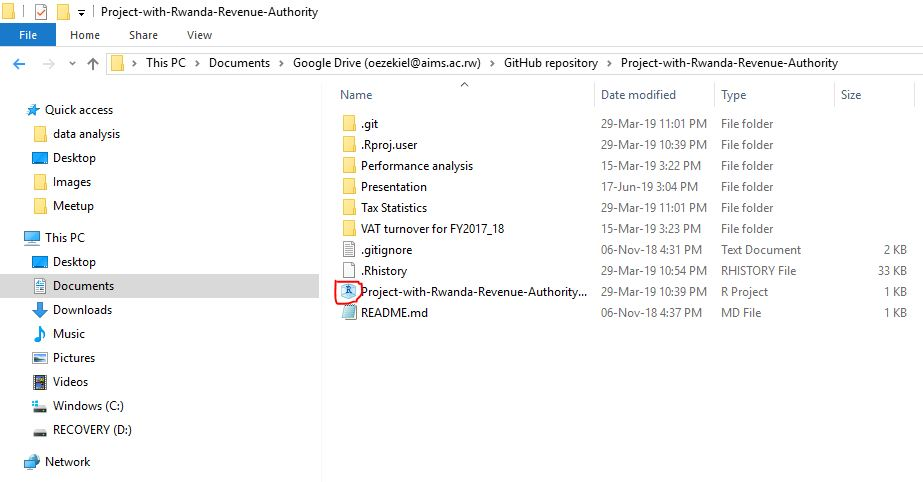
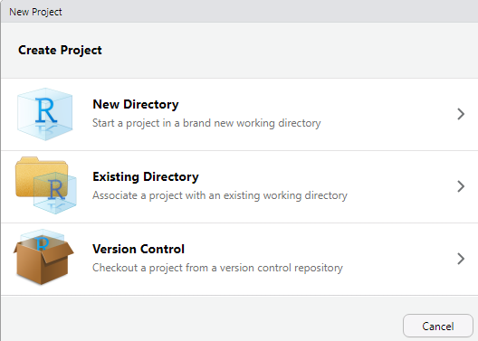
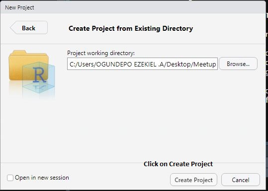
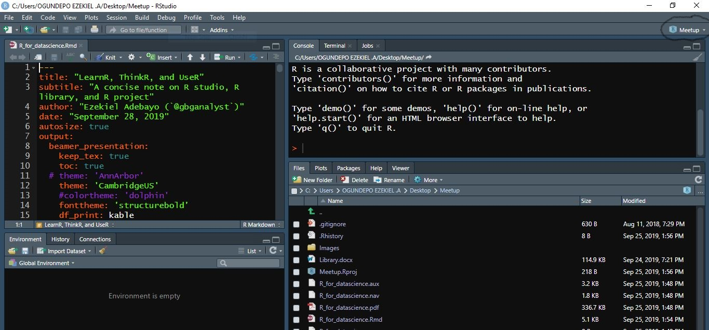
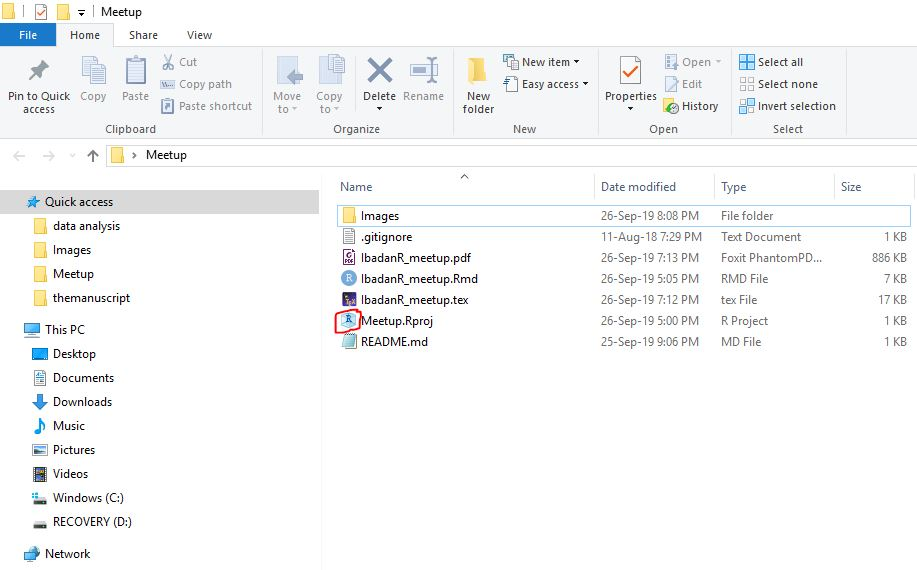

```{r setup, include=FALSE}
knitr::opts_chunk$set(echo = TRUE, tidy = "styler")
```

# About Me

**Name**: Ezekiel Adebayo Ogundepo \pause

**Twitter**: [\@gbganalyst](https://twitter.com/gbganalyst) \pause

**GitHub**: \url{www.github.com/gbganalyst} \pause

**Website**: \url{https://bit.ly/gbganalyst} 

---
\begin{center}
\textbf{Relax, programming in R is cool!}
\end{center}

If you doubt me, please ask Hadley Wickham, Jenny Bryan, and Adeyinka Oresanya.

 
# What is R programming?

R is a statistical programming language for data cleaning, analysis, and visualization 


# What about RStudio?

R Studio is an integrated development environment (IDE) for R programming. R Studio makes programming easier  and friendly in R.

# R studio



# R packages and library

A package is a collection of R functions that extends basic R functionality (base::functions). \pause

A package can contain a set of functions relating to a specific topic or tasks. For example, data wrangling packages include tidyr, janitor, etc. \pause

The location where the packages are stored is called the library. If there is a particular package that you need, you can install the package from the Comprehensive R Achieve Network (CRAN) by using:

```{r remedy01, eval = F, include=T}
install.packages('pkg_name')
```

# R packages and library


Other packages that are not yet on CRAN can also be installed from GitHub by using devtools package e.g. fakir


```{r remedy02 , eval = F}
library(devtools)
install_github("ThinkR-open/fakir")

```


# Import or load a package

To actually use the package, you need to use the command 

```{r remedy03, eval=F}
library("pkg_name")
```

which makes that package functions available to you at the R session.  

# Library

Library is a directory where the packages are stored. You can have multiple libraries on your hard disk. \pause

To see which libraries are available (which paths are searched for packages): \pause


```{r remedy05, warning= F, message= F}

.libPaths()

```

And to see which packages are there: \pause

#

```{r remedy005}

lapply(.libPaths(), dir)

```


# `library(x)` or `require(x)`?

`library(package)` and `require(package)` both load the namespace of the package with name package and attach it on the search list. require is designed for use inside other functions; it returns FALSE and gives a warning (rather than an error as `library()` does by default) if the package does not exist.

# Remove installed packages

Removes installed packages/bundles and updates index information as necessary.

```{r remedy006, eval=F}
remove.packages("pkg_name")
```


# Using functions in other packages with Double Colon operator

There are many ways to make use of functions in other packages. You can load the package with `library(pkg_name)` and then just use the functions. Or you can use the :: operator, for example writing `janitor::clean_name()` rather than `library(janitor)` and then `clean_name()`. \pause

The move is towards the latter, where only the necessary functions will be loaded, rather than attaching the whole package. So to carry the reader of your article on which function belongs to a particular package, it is better to use `package_name::function()`

# Where Does Your Analysis Live?
 
The working directory is where R looks for files that you ask it to load, and where it will put any files that you ask it to save.\pause

RStudio shows your current working directory at the top of the console:

 \pause

And you can also print this out by using:

```{r remedy007}
getwd()
```

#

If you have specific directory and you want to use that as your working directory, in R you can do that with the command `setwd()` e.g.

```{r , eval=FALSE}

setwd("/path/to/my/data_analysis")

```
or by using the keyboard shortcut with `Ctrl+Shift+H` and choose that specific directory (Folder).

# Paths and Directories

-  Absolute paths: This looks different in every computer. In Windows they start with a drive letter (e.g., C:).  In my R working directory I have
`"C:/Users/OGUNDEPO EZEKIEL.A/Desktop/Meetup"`
as absolute path.

You should never use absolute paths in your scripts, because they hinder sharing and  no one else will have exactly the same directory configuration as you.

-  Relative paths: With the help of library `here::here()` or `R project` we can have a relative path like 
`data/submission_format.csv` that allow for file sharing and collaboration.

# RStudio Projects
For a typical data science workflow, you should use Rstudio project.

R experts keep all the files associated with a project together—like data folder, R scripts folder, analytical results folder, figures folder. This is such a wise and common practice.

#



# Creating a new R project

Click File → New Project, then choose Existing Directory:



#



#



#




# Summary

Data science workflow can be done in Rstudio, and we talked about R packages, how to install them and how to load them. \pause

We also learnt about Rstudio project that enables us to organize our files i.e. keep data files, the script, save the outputs and by using only relative path. \pause

Everything you need is in one place, and cleanly separated from all the other projects that you are working on.

#

\begin{center}
\textbf{Thank you!}
\end{center}